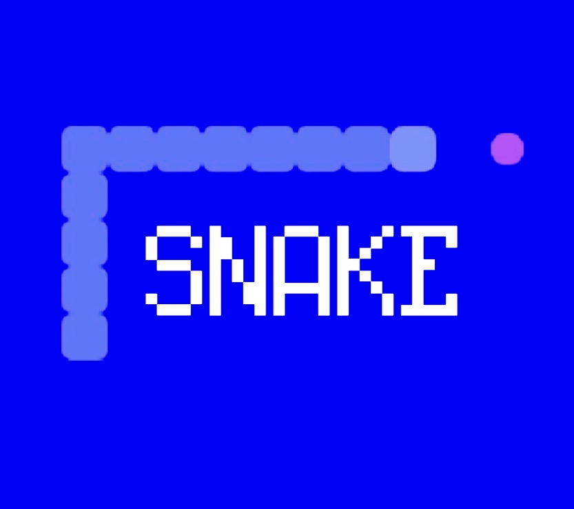

# 🐍 Snakebase - Snake Oyunu Mini App# Waitlist Mini App Quickstart

Farcaster ve Base üzerinde çalışan, modern bir snake (yılan) oyunu. OnchainKit ve Farcaster SDK kullanılarak geliştirilmiştir.This is a demo Mini App application built using OnchainKit and the Farcaster SDK. Build a waitlist sign-up mini app for your company that can be published to the Base app and Farcaster.

> [!IMPORTANT]

> Before interacting with this demo, please review our [disclaimer](#disclaimer) — there are **no official tokens or apps** associated with Cubey, Base, or Coinbase.

## 🎮 Özellikler

## Prerequisites

- **Klasik Snake Oyunu**: Mobil ve masaüstü için optimize edilmiş

- **Admin Panel**: Oyun ayarlarını dinamik olarak değiştirmeBefore getting started, make sure you have:

- **Blockchain Entegrasyonu**: Base blockchain üzerinde skor kaydetme (opsiyonel)

- **Mini App**: Farcaster uygulaması içinde çalışır\* Base app account

- **Redis/In-Memory Storage**: Ayarlar için kalıcı veya geçici depolama\* A [Farcaster](https://farcaster.xyz/) account

- **Responsive Design**: Tüm cihazlarda sorunsuz çalışır\* [Vercel](https://vercel.com/) account for hosting the application

* [Coinbase Developer Platform](https://portal.cdp.coinbase.com/) Client API Key

## 📋 Gereksinimler

## Getting Started

- **Node.js** 20.x veya üzeri

- **npm** veya **yarn**### 1. Clone this repository

- **Upstash Redis** hesabı (opsiyonel, in-memory alternatifi var)

- **Coinbase Developer Platform** API anahtarı```bash

- **Farcaster** hesabı (yayınlamak için)git clone https://github.com/base/demos.git

````

## 🚀 Hızlı Başlangıç

### 2. Install dependencies:

### 1. Projeyi Klonlayın

```bash

```bashcd demos/minikit/waitlist-mini-app-qs

git clone https://github.com/felixripper/snakebase.gitnpm install

cd snakebase```

````

### 3. Configure environment variables

### 2. Bağımlılıkları Yükleyin

Create a `.env.local` file and add your environment variables:

````bash

npm install```bash

```NEXT_PUBLIC_PROJECT_NAME="Your App Name"

NEXT_PUBLIC_ONCHAINKIT_API_KEY=<Replace-WITH-YOUR-CDP-API-KEY>

### 3. Çevre Değişkenlerini AyarlayınNEXT_PUBLIC_URL=

````

`.example.env` dosyasını `.env.local` olarak kopyalayın:

### 4. Run locally:

````bash

cp .example.env .env.local```bash

```npm run dev

````

Ardından `.env.local` dosyasını düzenleyip değerlerinizi girin:

## Customization

````env

# Zorunlu alanlar### Update Manifest Configuration

NEXT_PUBLIC_URL=http://localhost:3000

NEXT_PUBLIC_ONCHAINKIT_API_KEY=your_api_key_hereThe `minikit.config.ts` file configures your manifest located at `app/.well-known/farcaster.json`.

ADMIN_USERNAME=admin

ADMIN_PASSWORD=your_secure_password**Skip the `accountAssociation` object for now.**

SECRET_COOKIE_PASSWORD=your_secret_32_chars_or_more

To personalize your app, change the `name`, `subtitle`, and `description` fields and add images to your `/public` folder. Then update their URLs in the file.

# Opsiyonel: Redis kullanmak için

UPSTASH_REDIS_REST_URL=https://your-redis.upstash.io## Deployment

UPSTASH_REDIS_REST_TOKEN=your_token_here

```### 1. Deploy to Vercel


**Not:** `SECRET_COOKIE_PASSWORD` için rastgele 32 karakterden uzun bir değer kullanın:```bash

```bashvercel --prod

openssl rand -base64 32```

````

You should have a URL deployed to a domain similar to: `https://your-vercel-project-name.vercel.app/`

### 4. Geliştirme Sunucusunu Başlatın

### 2. Update environment variables

```bash

npm run devAdd your production URL to your local `.env` file:

```

```bash

Tarayıcınızda [http://localhost:3000](http://localhost:3000) adresini açın.NEXT_PUBLIC_PROJECT_NAME="Your App Name"

NEXT_PUBLIC_ONCHAINKIT_API_KEY=<Replace-WITH-YOUR-CDP-API-KEY>

## 🎯 KullanımNEXT_PUBLIC_URL=https://your-vercel-project-name.vercel.app/

```

### Oyun Oynama

### 3. Upload environment variables to Vercel

1. Ana sayfaya gidin: `http://localhost:3000`

2. "Oyna" butonuna tıklayınAdd environment variables to your production environment:

3. **Masaüstü**: Yön tuşları (↑ ↓ ← →) ile oynayın

4. **Mobil**: Parmağınızı kaydırarak yön verin```bash

vercel env add NEXT_PUBLIC_PROJECT_NAME production

### Admin Panelvercel env add NEXT_PUBLIC_ONCHAINKIT_API_KEY production

vercel env add NEXT_PUBLIC_URL production

1. `/login` sayfasına gidin```

2. `.env.local` dosyasındaki kullanıcı adı ve şifre ile giriş yapın

3. İki farklı ayar sayfası var:## Account Association

   - `/admin` - Basit ayarlar (renk, hız, puan)

   - `/admin/settings` - Gelişmiş ayarlar (grid boyutu, engeller, vb.)### 1. Sign Your Manifest

### Admin Panel Özellikleri1. Navigate to [Farcaster Manifest tool](https://farcaster.xyz/~/developers/mini-apps/manifest)

2. Paste your domain in the form field (ex: your-vercel-project-name.vercel.app)

- **Renk Ayarları**: Yılan, yem ve arkaplan renkleri3. Click the `Generate account association` button and follow the on-screen instructions for signing with your Farcaster wallet

- **Oyun Mekaniği**: Hız, grid boyutu, engeller4. Copy the `accountAssociation` object

- **Puanlama**: Yem başına puan değeri

- **Kontrol Şeması**: Klavye, kaydırma veya butonlar### 2. Update Configuration

- **Görünüm**: Canvas boyutu, tema renkleri

Update your `minikit.config.ts` file to include the `accountAssociation` object:

## 📦 Vercel'e Deploy

````ts

### 1. Vercel CLI ile Deployexport const minikitConfig = {

    accountAssociation: {

```bash        "header": "your-header-here",

npm install -g vercel        "payload": "your-payload-here",

vercel login        "signature": "your-signature-here"

vercel --prod    },

```    frame: {

        // ... rest of your frame configuration

### 2. Environment Variables Ekleyin    },

}

Deploy sonrası production URL'inizi alın ve environment variables ekleyin:```


```bash### 3. Deploy Updates

vercel env add NEXT_PUBLIC_URL production

vercel env add NEXT_PUBLIC_ONCHAINKIT_API_KEY production```bash

vercel env add ADMIN_USERNAME productionvercel --prod

vercel env add ADMIN_PASSWORD production```

vercel env add SECRET_COOKIE_PASSWORD production

vercel env add UPSTASH_REDIS_REST_URL production## Testing and Publishing

vercel env add UPSTASH_REDIS_REST_TOKEN production

```### 1. Preview Your App


### 3. Tekrar Deploy EdinGo to [base.dev/preview](https://base.dev/preview) to validate your app:


```bash1. Add your app URL to view the embeds and click the launch button to verify the app launches as expected

vercel --prod2. Use the "Account association" tab to verify the association credentials were created correctly

```3. Use the "Metadata" tab to see the metadata added from the manifest and identify any missing fields


## 🔗 Farcaster'da Yayınlama### 2. Publish to Base App


### 1. Manifest Dosyasını İmzalayınTo publish your app, create a post in the Base app with your app's URL.


1. [Farcaster Manifest Tool](https://farcaster.xyz/~/developers/mini-apps/manifest) sayfasına gidin## Learn More

2. Domain'inizi girin (örn: `snakebase.vercel.app`)

3. "Generate account association" butonuna tıklayınFor detailed step-by-step instructions, see the [Create a Mini App tutorial](https://docs.base.org/docs/mini-apps/quickstart/create-new-miniapp/) in the Base documentation.

4. Farcaster cüzdanınızla imzalayın

5. Oluşan `accountAssociation` objesini kopyalayın

---

### 2. Manifest'i Güncelleyin

## Disclaimer

`minikit.config.ts` dosyasındaki `accountAssociation` bölümünü güncelleyin:

This project is a **demo application** created by the **Base / Coinbase Developer Relations team** for **educational and demonstration purposes only**.

```typescript

export const minikitConfig = {**There is no token, cryptocurrency, or investment product associated with Cubey, Base, or Coinbase.**

  accountAssociation: {

    header: "your-header-here",Any social media pages, tokens, or applications claiming to be affiliated with, endorsed by, or officially connected to Cubey, Base, or Coinbase are **unauthorized and fraudulent**.

    payload: "your-payload-here",

    signature: "your-signature-here"We do **not** endorse or support any third-party tokens, apps, or projects using the Cubey name or branding.

  },

  // ... diğer ayarlar> [!WARNING]

}> Do **not** purchase, trade, or interact with any tokens or applications claiming affiliation with Coinbase, Base, or Cubey.

```> Coinbase and Base will never issue a token or ask you to connect your wallet for this demo.


### 3. Deploy ve Test EdinFor official Base developer resources, please visit:

- [https://base.org](https://base.org)

```bash- [https://docs.base.org](https://docs.base.org)

vercel --prod

```---


[base.dev/preview](https://base.dev/preview) adresinde önizleyin.

## 🛠️ Smart Contract (Opsiyonel)

Blockchain üzerinde skor kaydetmek için:

### 1. Contract'ı Deploy Edin

```bash
# .env.local dosyasına ekleyin:
# BASE_MAINNET_RPC=https://mainnet.base.org
# DEPLOY_PRIVATE_KEY=your_private_key

npx hardhat run scripts/deploy.ts --network base_mainnet
````

### 2. Contract Adresini Kaydedin

Deploy sonrası çıkan adresi `.env.local` dosyasına ekleyin:

```env
GAME_SCORE_CONTRACT_ADDRESS=0x...
```

## 🏗️ Proje Yapısı

```
snakebase/
├── app/                      # Next.js app directory
│   ├── admin/               # Admin panel sayfaları
│   ├── api/                 # API routes
│   │   ├── auth/           # Farcaster authentication
│   │   ├── config/         # Oyun ayarları (basit)
│   │   ├── game-config/    # Oyun ayarları (API)
│   │   ├── login/          # Admin login
│   │   ├── logout/         # Admin logout
│   │   └── redis/          # Redis health check
│   ├── login/              # Login sayfası
│   └── page.tsx            # Ana oyun sayfası
├── contracts/               # Solidity smart contracts
│   └── GameScore.sol       # Skor kaydetme contract'ı
├── lib/                     # Yardımcı kütüphaneler
│   ├── auth.ts             # Authentication helpers
│   ├── config.ts           # Konfigürasyon yönetimi
│   ├── redis.ts            # Redis/memory storage
│   └── session.ts          # Session yönetimi
├── public/                  # Statik dosyalar
│   └── eat-grow.html       # Oyun motoru (HTML5 Canvas)
├── middleware.ts            # Next.js middleware (route protection)
├── minikit.config.ts        # Farcaster mini app config
└── hardhat.config.ts        # Hardhat blockchain config
```

## 🔧 Geliştirme

### Kod Kalitesi

```bash
# Lint kontrolü
npm run lint

# Build testi
npm run build
```

### Ayarlar Sistemi

İki farklı konfigürasyon sistemi var:

1. **SimpleConfig** (`/api/config` ve `/api/game-config`)

   - Temel oyun ayarları (renk, hız, puan)
   - Admin panel tarafından kullanılır

2. **GameConfig** (`lib/config.ts`)
   - Gelişmiş ayarlar (grid, engeller, power-ups)
   - İleride genişletilebilir

### Redis vs In-Memory

- **Redis**: Production için önerilir, ayarlar kalıcıdır
- **In-Memory**: Development için uygundur, restart'ta sıfırlanır

## 📝 API Endpoints

### Public Endpoints

- `GET /api/config` - Oyun ayarlarını getir
- `GET /api/game-config` - Oyun ayarlarını getir (alias)
- `GET /api/redis/health` - Redis bağlantı durumu
- `GET /api/redis/env` - Environment variable kontrol

### Protected Endpoints (Admin Only)

- `POST /api/login` - Admin girişi
- `GET /api/logout` - Admin çıkışı
- `POST /api/config` - Ayarları kaydet
- `PUT /api/config` - Ayarları güncelle
- `PUT /api/game-config` - Ayarları güncelle

## 🐛 Sorun Giderme

### "Missing UPSTASH_REDIS_REST_URL" Hatası

Redis kullanmak istemiyorsanız, bu değişkenleri boş bırakın. In-memory storage kullanılacaktır.

### Admin Panel'e Giriş Yapamıyorum

1. `.env.local` dosyasında `ADMIN_USERNAME` ve `ADMIN_PASSWORD` tanımlı mı?
2. `SECRET_COOKIE_PASSWORD` en az 32 karakter mi?
3. Tarayıcı cookie'lerini temizleyin

### Oyun Yüklenmiyor

1. `http://localhost:3000` adresini kontrol edin
2. Browser console'da hata var mı?
3. `npm run dev` komutu çalışıyor mu?

## 📚 Teknolojiler

- **Next.js 15** - React framework
- **TypeScript** - Tip güvenliği
- **OnchainKit** - Coinbase blockchain toolkit
- **Farcaster SDK** - Mini app entegrasyonu
- **Upstash Redis** - Serverless Redis
- **Iron Session** - Güvenli session yönetimi
- **Hardhat** - Smart contract geliştirme
- **Wagmi** - Ethereum React hooks
- **Viem** - TypeScript Ethereum library

## 🤝 Katkıda Bulunma

1. Fork yapın
2. Feature branch oluşturun (`git checkout -b feature/amazing-feature`)
3. Commit yapın (`git commit -m 'feat: Add amazing feature'`)
4. Push yapın (`git push origin feature/amazing-feature`)
5. Pull Request açın

## 📄 Lisans

Bu proje MIT lisansı altında lisanslanmıştır. Detaylar için [LICENSE](LICENSE) dosyasına bakın.

## 🙏 Teşekkürler

Bu proje [Base Waitlist Mini App Quickstart](https://github.com/base/demos) template'inden esinlenilmiştir.

## 📧 İletişim

- **Geliştirici**: [felixripper](https://github.com/felixripper)
- **Proje**: [github.com/felixripper/snakebase](https://github.com/felixripper/snakebase)

---

**Not**: Bu proje eğitim ve demo amaçlıdır. Production kullanımı için ek güvenlik önlemleri almanız önerilir.
